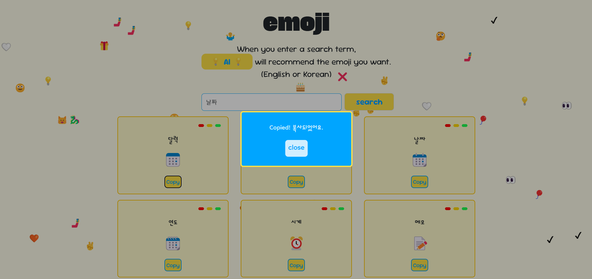

# 🫴이모지 추천기 emoji

---


### 📣 소개

검색어에 따라 `Gemini`를 사용한 인공지능으로 이모지를 추천해주는 이모지 추천기 **emoji**

Notion 문서의 목차에 이모지를 추가하면 시각적으로 더 보기 좋아져서 자주 활용하곤 한다. 

하지만 **적절한 이모지**를 찾기가 쉽지 않았다. 그래서 이러한 **불편함을 해소하고자 관련 웹사이트를 직접 개발**하게 되었다.

### ⚙️ 사용 기술

- `html` : 전반적인 웹 페이지의 구성
- `css` : 웹 페이지의 디자인을 위해 사용
- `Java Script` : `react`내에서 기능을 구현
- `react` : 웹 페이지 내의 매끄러운 전환과 유용한 기능을 넣기 위해 사용
- `p5.js` : 배경에 내려오는 이모지 구현

### 📖 Installation

1. Clone the Repository
```bash 
git clone https://github.com/JINJIYU23/Emoji-Recommender.git
cd Emoji-Recommender
```

2. 필요한 react 라이브러리 설치

```bash
npm install
```

3. Google AI 연동
- [https://aistudio.google.com/prompts/new_chat](https://aistudio.google.com/prompts/new_chat)에서 API key 발급
- `.env` 파일 생성 후 아래 코드 입력

```bash
REACT_APP_GOOGLE_API_KEY=<YOUR API KEY>
```

4. 🎉 start **emoji 🎉**

- http://localhost:3000/ 로 접속 가능!
```jsx
npm start
```

---

### ✅결과


메인 화면


영어 버전 검색 결과


한글 버전 검색 결과



이모지가 복사 된 후 뜨는 창


아무것도 입력하지 않았을 때 알림


이상한 단어를 입력했을 때 에러 메세지